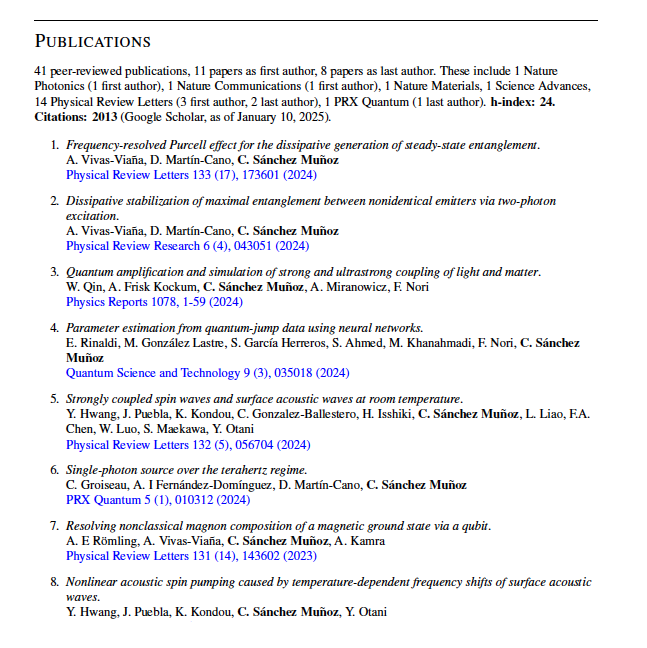

# Google Scholar Scraping Tools


This repository provides tools for scraping publication data from Google Scholar and generating formatted LaTeX reports. The package includes both Python functions for programmatic use and a command-line interface (CLI) for quick scraping.
This tool does not depend on an API; it uses Selenium to manually navigate across the pages and extract the desired information.

---

## Features

- **Google Scholar Scraping**: Extract detailed information about publications, including title, authors, journal, year, citations, and more.
- **Pseudonym Handling**: Unify author names across variations (e.g., "C S Munoz" → "C. Sánchez Muñoz").
- **LaTeX Report Generation**: Automatically generate LaTeX-formatted lists of publications and summary statistics for academic CVs or reports.

<p align="center">
</p>
- **Command-Line Interface**: Easily scrape Google Scholar data and save it to a CSV file directly from the terminal.
---

## Installation

- Clone this directory
- cd to the current folder `cd GS_Scrape`
- (Recommended) Create a new Python environment and activate it. For instance, using conda, you can create and activate an environment with name `gsscrape`, using Python 3.9, as

```shell
conda create -n gsscrape python=3.9
conda activate gsscrape
```

- Install the `gsscrape` as an editable python package with its dependencies

```shell
pip install -e .
```

In Windows you might need to use a package manager such as Anaconda before
installing the `gsscrape` package.

The details to install conda or a lightweight version called miniconda can be
found below:

- [`conda`](https://docs.conda.io/projects/conda/en/latest/user-guide/getting-started.html)
- [`miniconda`](https://docs.conda.io/en/latest/miniconda.html)

## Usage Examples

This package can be used programmatically in Python scripts or notebooks, or directly from the terminal via its command-line interface (CLI).

---

### 1. Programmatic Use

Import the provided functions into your Python scripts or Jupyter notebooks:

```python
from gsscrape.scraper import getGSdata
from gsscrape.reporter import generate_latex_report

# Scrape data from Google Scholar
df_papers = getGSdata(
    scholarUserId="-VPPZ8YAAAAJ",  # Replace with your Google Scholar ID
    name="C. Sánchez Muñoz",       # The canonical name of the author
    pseudonyms=["C S Munoz", "C S Muñoz"]  # Alternate names to unify
)

# Save the scraped data to a CSV file
df_papers.to_csv("papers.csv", index=False)

# Generate a LaTeX report
generate_latex_report(
    df_papers=df_papers, 
    name="C. Sánchez Muñoz", 
    output_file="publications_report.tex"
)
```

### 2. Command-Line Interface (CLI)

You can run the scraper directly from the terminal to scrape Google Scholar data and save it as a CSV file.

#### Example Command:
```bash
python gsscrape/scraper.py --scholar_id="-VPPZ8YAAAAJ" --name "C. Sánchez Muñoz" --pseudonyms "C S Munoz" "C S Muñoz" --output papers.csv
```
#### Arguments:
- `--scholar_id` *(required)*:  
  The Google Scholar user ID. This is a unique identifier for the author, e.g., `-VPPZ8YAAAAJ`.  
  Ensure the ID is enclosed in quotes if it starts with a dash (`-`).

- `--name` *(required)*:  
  The canonical name of the author to highlight in the authors' list. Example: `"C. Sánchez Muñoz"`.

- `--pseudonyms` *(required)*:  


## Notebooks

### [example_usage.ipynb](https://github.com/CarlosSMWolff/GS_Scrape/blob/main/notebooks/example_usage.ipynb)

Notebook with example usage: download the papers as a dataframe and use it to generate a LaTeX snippet for your CV.
